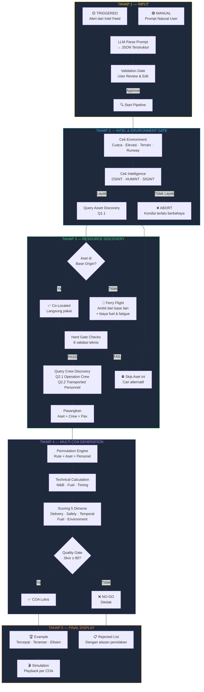
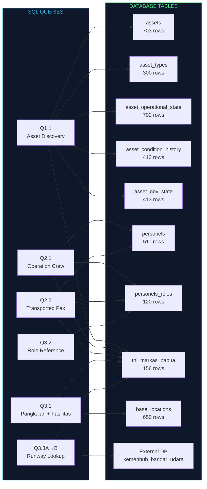
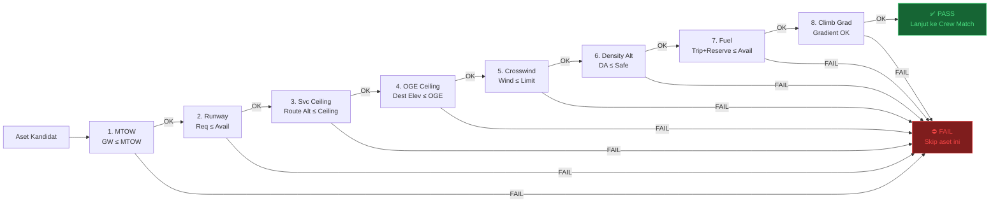
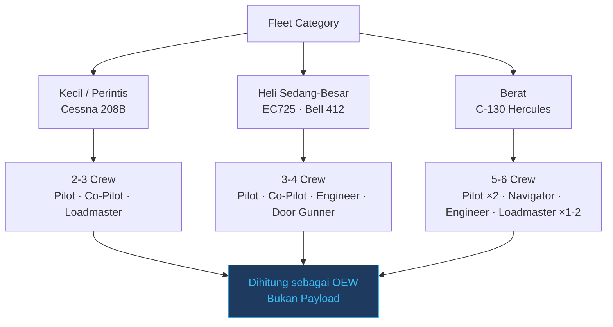

# Aerobridge Pipeline Flow

## 1. Main Pipeline (End-to-End)

```mermaid
flowchart TD
    subgraph INPUT["TAHAP 1 — INPUT"]
        T["🟡 TRIGGERED\nAlert dari Intel Feed"]
        M["🟢 MANUAL\nPrompt Natural User"]
        T --> PARSE
        M --> PARSE
        PARSE["LLM Parse Prompt\n→ JSON Terstruktur"]
        PARSE --> VG["Validation Gate\nUser Review & Edit"]
        VG -->|"Approve"| START
    end

    subgraph GATE2["TAHAP 2 — INTEL & ENVIRONMENT GATE"]
        START["🔍 Start Pipeline"] --> ENV
        ENV["Cek Environment\nCuaca · Elevasi · Terrain · Runway"]
        ENV --> INTEL["Cek Intelligence\nOSINT · HUMINT · SIGINT"]
        INTEL -->|"Layak"| RES
        INTEL -->|"Tidak Layak"| ABORT["❌ ABORT\nKondisi terlalu berbahaya"]
    end

    subgraph GATE3["TAHAP 3 — RESOURCE DISCOVERY"]
        RES["Query Asset Discovery\nQ1.1"] --> COLOC{"Aset di\nBase Origin?"}
        COLOC -->|"Ya"| COLOCATED["✅ Co-Located\nLangsung pakai"]
        COLOC -->|"Tidak"| FERRY["🔄 Ferry Flight\nAmbil dari base lain\n+ biaya fuel & fatigue"]
        COLOCATED --> HG
        FERRY --> HG
        HG["Hard Gate Checks\n8 validasi teknis"]
        HG -->|"PASS"| CREW["Query Crew Discovery\nQ2.1 Operation Crew\nQ2.2 Transported Personnel"]
        HG -->|"FAIL"| SKIP["⛔ Skip Aset Ini\nCari alternatif"]
        SKIP --> RES
        CREW --> PAIR["Pasangkan\nAset + Crew + Pax"]
    end

    subgraph GATE4["TAHAP 4 — MULTI COA GENERATION"]
        PAIR --> PERM["Permutation Engine\nRute × Aset × Personel"]
        PERM --> CALC["Technical Calculation\nM&B · Fuel · Timing"]
        CALC --> SCORE["Scoring 5 Dimensi\nDelivery · Safety · Temporal\nFuel · Environment"]
        SCORE --> QG{"Quality Gate\nSkor ≥ 80?"}
        QG -->|"Ya"| PASS["✅ COA Lolos"]
        QG -->|"Tidak"| NOGO["❌ NO-GO\nDitolak"]
    end

    subgraph GATE5["TAHAP 5 — FINAL DISPLAY"]
        PASS --> TOP3["🏆 Example \nTercepat · Teraman · Efisien"]
        NOGO --> LIST["📋 Rejected List\nDengan alasan penolakan"]
        TOP3 --> SIM["🎬 Simulation\nPlayback per COA"]
    end

    style INPUT fill:#1e293b,stroke:#facc15,color:#facc15
    style GATE2 fill:#1e293b,stroke:#38bdf8,color:#38bdf8
    style GATE3 fill:#1e293b,stroke:#4ade80,color:#4ade80
    style GATE4 fill:#1e293b,stroke:#a78bfa,color:#a78bfa
    style GATE5 fill:#1e293b,stroke:#fb923c,color:#fb923c
```

---

## 2. Database Query Map (SQL ↔ DB Tables)

```mermaid
flowchart LR
    subgraph QUERIES["SQL QUERIES"]
        Q1["Q1.1\nAsset Discovery"]
        Q2A["Q2.1\nOperation Crew"]
        Q2B["Q2.2\nTransported Pax"]
        Q3A["Q3.1\nPangkalan + Fasilitas"]
        Q3B["Q3.2\nRole Reference"]
        Q3C["Q3.3A→B\nRunway Lookup"]
    end

    subgraph TABLES["DATABASE TABLES"]
        T1["assets\n703 rows"]
        T2["asset_types\n300 rows"]
        T3["asset_operational_state\n702 rows"]
        T4["asset_condition_history\n413 rows"]
        T5["asset_gov_state\n413 rows"]
        T6["personels\n511 rows"]
        T7["personels_roles\n120 rows"]
        T8["tni_markas_papua\n156 rows"]
        T9["base_locations\n650 rows"]
        T10["External DB\nkemenhub_bandar_udara"]
    end

    Q1 --> T1
    Q1 --> T2
    Q1 --> T3
    Q1 --> T4
    Q1 --> T5
    Q1 --> T8

    Q2A --> T6
    Q2A --> T7
    Q2A --> T8

    Q2B --> T6
    Q2B --> T7
    Q2B --> T8

    Q3A --> T8
    Q3A --> T9

    Q3B --> T7

    Q3C --> T8
    Q3C --> T10

    style QUERIES fill:#0f172a,stroke:#38bdf8,color:#38bdf8
    style TABLES fill:#0f172a,stroke:#4ade80,color:#4ade80
```

---

## 3. Hard Gate Checks Detail

```mermaid
flowchart LR
    AC["Aset Kandidat"] --> G1["1. MTOW\nGW ≤ MTOW"]
    G1 -->|OK| G2["2. Runway\nReq ≤ Avail"]
    G2 -->|OK| G3["3. Svc Ceiling\nRoute Alt ≤ Ceiling"]
    G3 -->|OK| G4["4. OGE Ceiling\nDest Elev ≤ OGE"]
    G4 -->|OK| G5["5. Crosswind\nWind ≤ Limit"]
    G5 -->|OK| G6["6. Density Alt\nDA ≤ Safe"]
    G6 -->|OK| G7["7. Fuel\nTrip+Reserve ≤ Avail"]
    G7 -->|OK| G8["8. Climb Grad\nGradient OK"]
    G8 -->|OK| PASS2["✅ PASS\nLanjut ke Crew Match"]

    G1 -->|FAIL| F["⛔ FAIL\nSkip aset ini"]
    G2 -->|FAIL| F
    G3 -->|FAIL| F
    G4 -->|FAIL| F
    G5 -->|FAIL| F
    G6 -->|FAIL| F
    G7 -->|FAIL| F
    G8 -->|FAIL| F

    style PASS2 fill:#166534,stroke:#4ade80,color:#4ade80
    style F fill:#7f1d1d,stroke:#ef4444,color:#ef4444
```

---

## 4. Crew Sizing SOP

```mermaid
flowchart TD
    FLEET["Fleet Category"] --> K["Kecil / Perintis\nCessna 208B"]
    FLEET --> H["Heli Sedang-Besar\nEC725 · Bell 412"]
    FLEET --> B["Berat\nC-130 Hercules"]

    K --> KC["2-3 Crew\nPilot · Co-Pilot · Loadmaster"]
    H --> HC["3-4 Crew\nPilot · Co-Pilot · Engineer · Door Gunner"]
    B --> BC["5-6 Crew\nPilot ×2 · Navigator · Engineer · Loadmaster ×1-2"]

    KC --> OEW["Dihitung sebagai OEW\nBukan Payload"]
    HC --> OEW
    BC --> OEW

    style OEW fill:#1e3a5f,stroke:#38bdf8,color:#38bdf8
```
